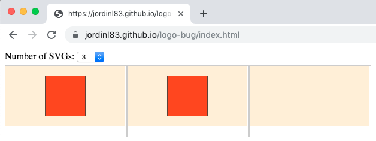
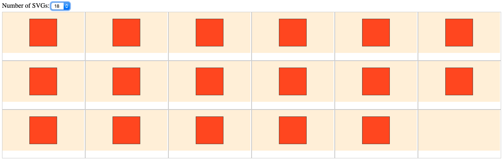
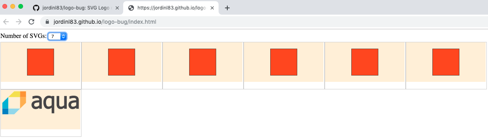
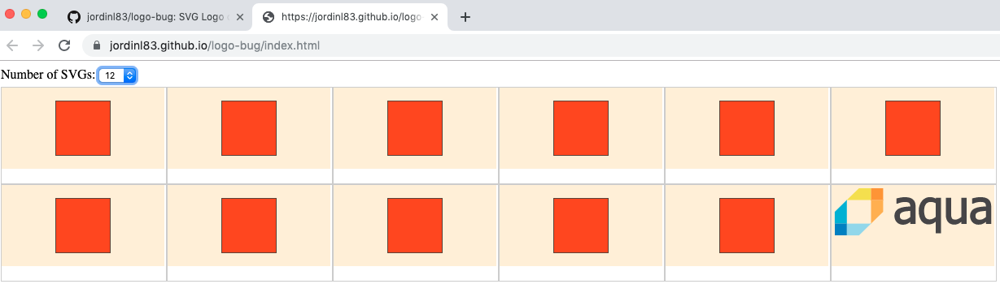
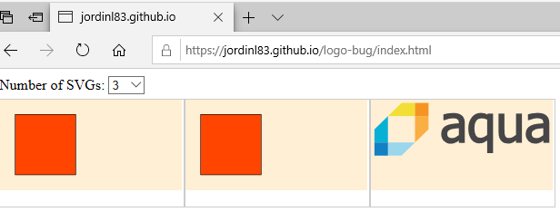
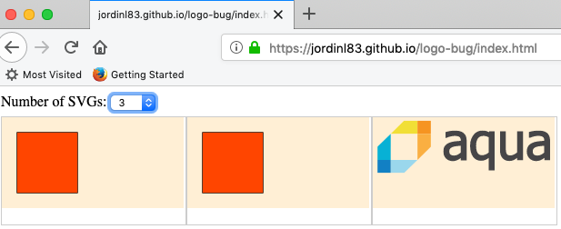

# logo-bug

An SVG logo does not render under some circumstances in Chrome.

The logo is:

Demo: https://jordinl83.github.io/logo-bug/index.html

## In Chrome the logo does not show depending on the position:

## In Chrome the logo shows sometimes:

## In Firefox the logo is rendered correctly:

## In Safari the logo is rendered correctly:

## In MS Edge the logo is rendered correctly:

